**2026-03-27 時点で編集中です. GB 開始または GBの途中で多少編集する可能性があります.**

# Snowball44 v2 ビルドガイド

販売するタイミングや工場との兼ね合いで微妙に同梱されるパーツが異なる可能性があるので, バージョンを分けてビルドガイドを書いています

## 販売箇所

- キーケット 2025
- ref:
  - [https://catalog.keyket.jp/tokyo-2025/exhibitor/D-03](https://catalog.keyket.jp/tokyo-2025/exhibitor/D-03)

## 同梱物の確認


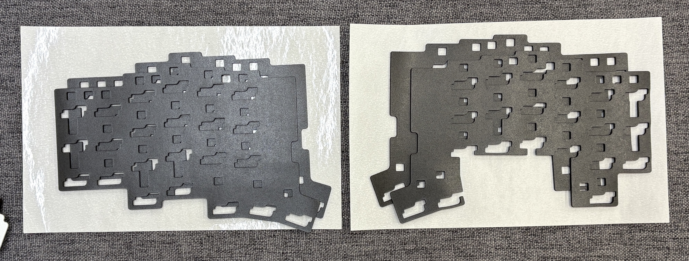
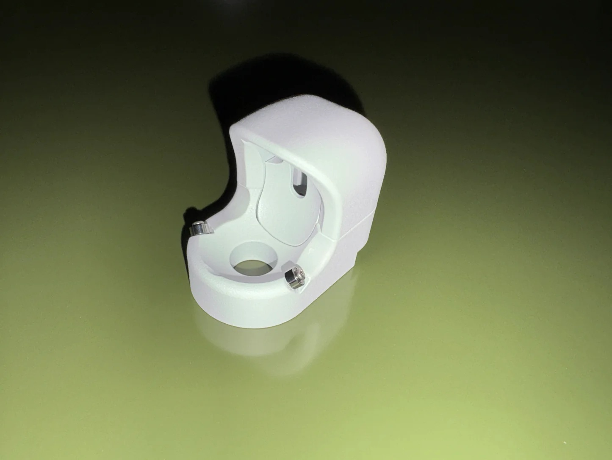
| 名称                                           | 個数                       |
| ---------------------------------------------- | -------------------------- |
| ケース左右一式                                 | 1 対                       |
| ケース+ウェイト締結用ネジ                      | ケースにそのままついてます |
| ケースフォーム(LED 用の穴があいているもの)     | 1 対                       |
| ケースフォーム(LED 用の穴があいていないもの)   | 1 対                       |
| スイッチフォーム                               | 1 対                       |
| スイッチプレート                               | 1 対                       |
| ガスケット (粘着付フォーム)                    | 1 対                       |
| ゴム足                                         | 8 個                       |
| 組立済トラックボールケース(34mm or 25mm)       | 1 個                       |
| 三日月形プレート(25mmトラックボールケースのみ) | 1 個                       |
| トラックボールケース固定用ネジ M1.7            | 2 本                       |
| カプトンテープ（黄色）                         | 適当な長さ                 |

## ケース

### ガスケットの貼付


長さは 2 種類ありますので (肉眼で区別できるサイズです) , それぞれ 1 or 2 の箇所に貼りましょう

### ケースフォームの設置


ケースフォームを設定します. LED 穴空きが 2 枚と LED 穴なしが 1 枚入っているので, LED の実装の有無によって設置してください

- LED をはんだしている場合: LED 穴空き 2 枚
- LED をはんだしていない場合: LED 穴空き 1 枚 + 穴無し 1 枚

想定は上記のとおりですが, フォームなし, 1 枚だけ, お好きな形でお使いいただいて問題ﾅｼです

### スイッチフォームの設置


左右の基盤の上に写真のように乗せます

### スイッチプレートの取り付け

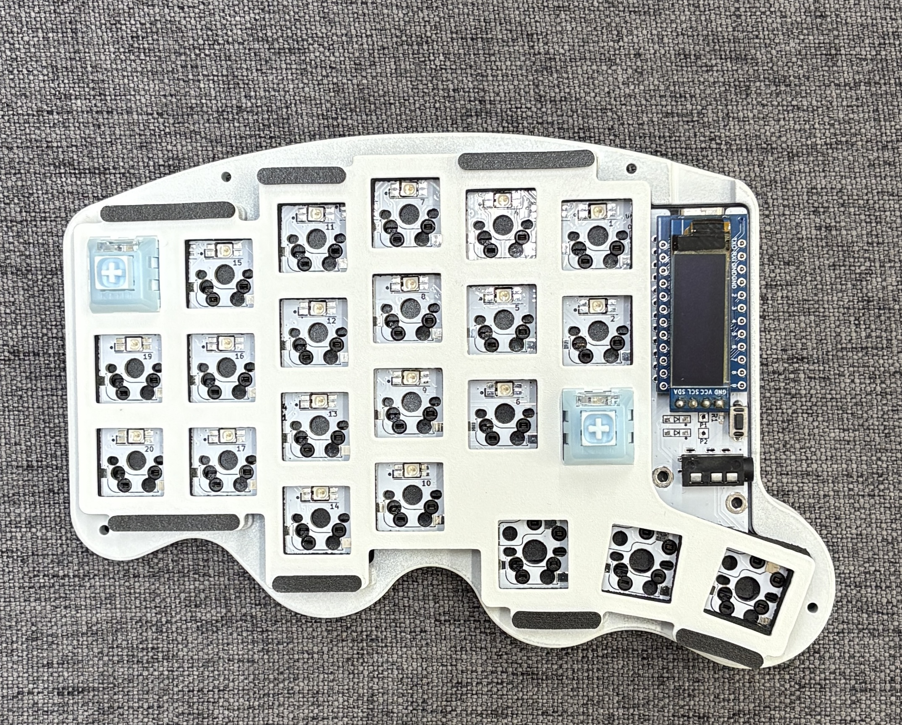

スイッチプレートをスイッチフォームの上に乗せ,

```
スイッチプレート
スイッチフォーム
基盤
ケースフォーム
ボトムケース
```

の順番になるように組みましょう. この時, 写真のようにいくつかのスイッチをはめ込んで, 基盤, スイッチフォーム, スイッチプレートがずれないように固定します.

### ケースの上下締結


もともと外したネジで, ケース上下をねじ止めします

### ゴム足の取り付け

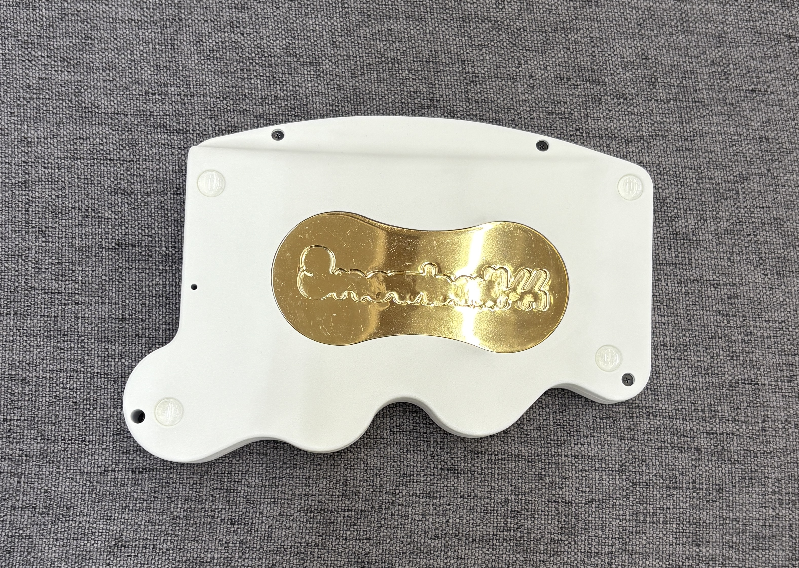

### 右側も同様に


右側も左側と同様に, ケースフォーム, 基盤, スイッチフォーム, スイッチプレートと設置し, ケースをネジで締結しましょう

## optional

リセットスイッチが押せるようにボディの底面に穴を開けてあるので, 基盤のリセットスイッチ ( タクトスイッチ ) をひっくり返してはんだすることが可能です

まずはコレにてケースケースは完了です!! お疲れ様でした!! ここからはトラックボールケースの組み立てです!!

## トラックボールケース

### カプトンテープ貼り付け

念のため、短絡を防止する目的でカプトンテープを貼り付けます。  
（下の写真は参考です。気になる部分に貼ってください）  
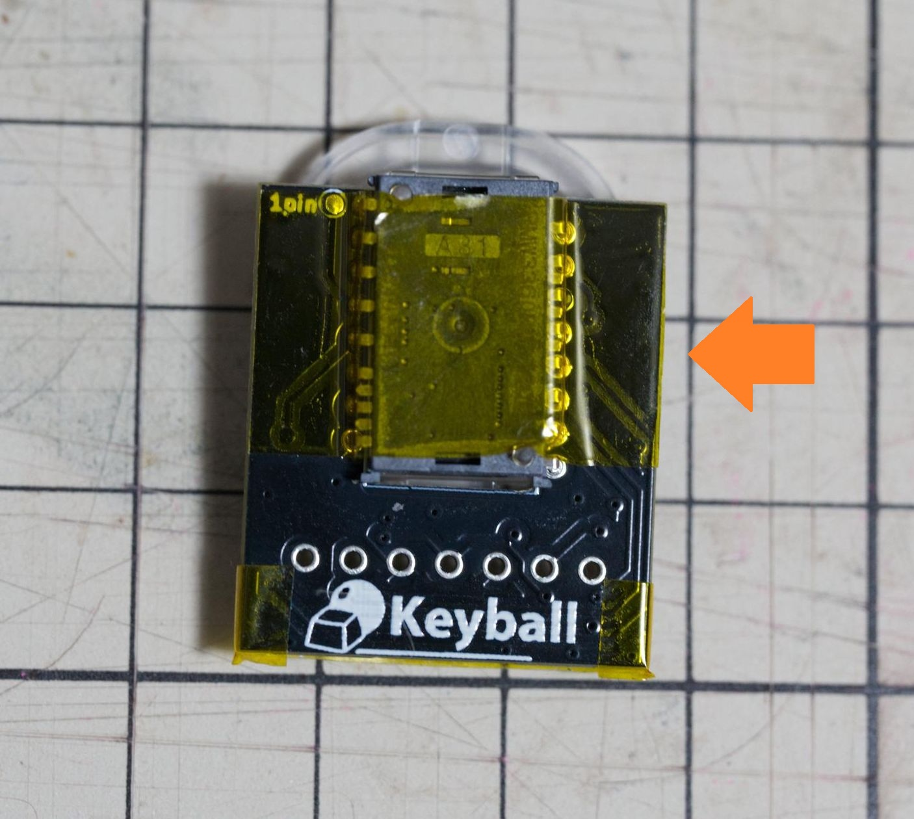  
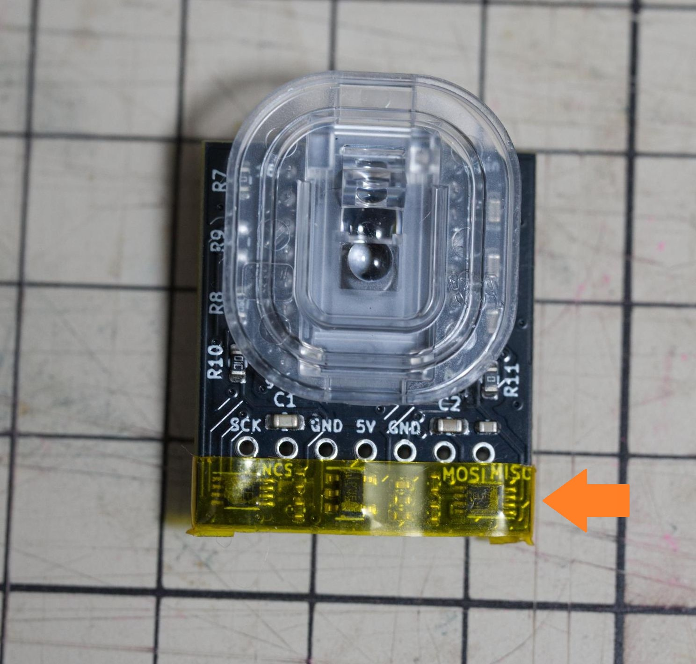  
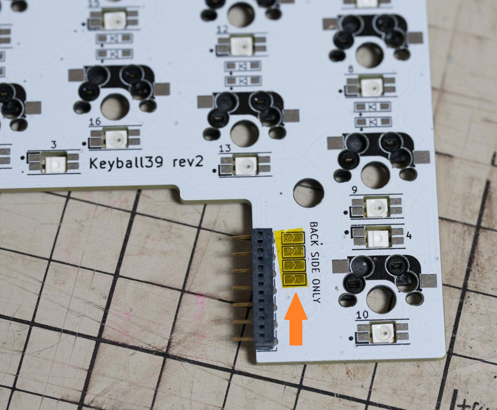  

### トラックボールはめ込み時の保護
好みに応じて、トラックボールをはめ込む際に傷がつかないようにトラックボールケースの内側の上下にあるくぼみ部分にレジンを少量盛ります。  
（UVレジンより二液性レジンのほうがおすすめですが、お好みで）  
盛った後は完全に硬化するまで待ちます。  
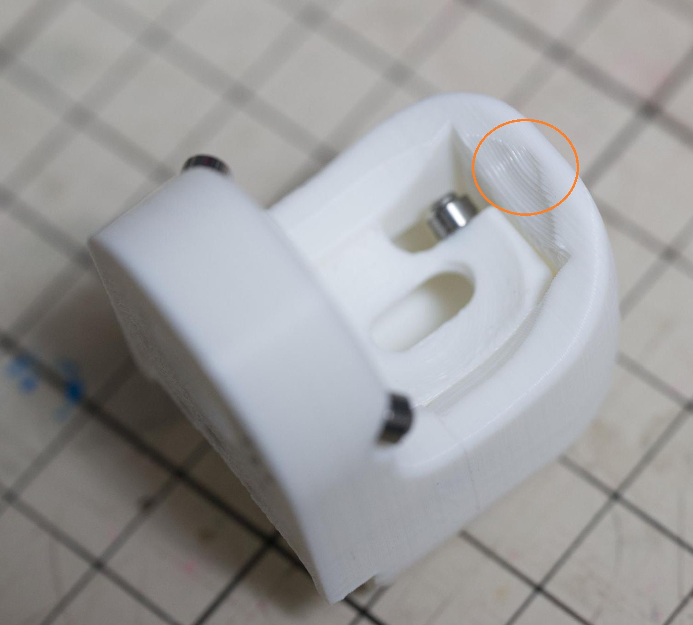  
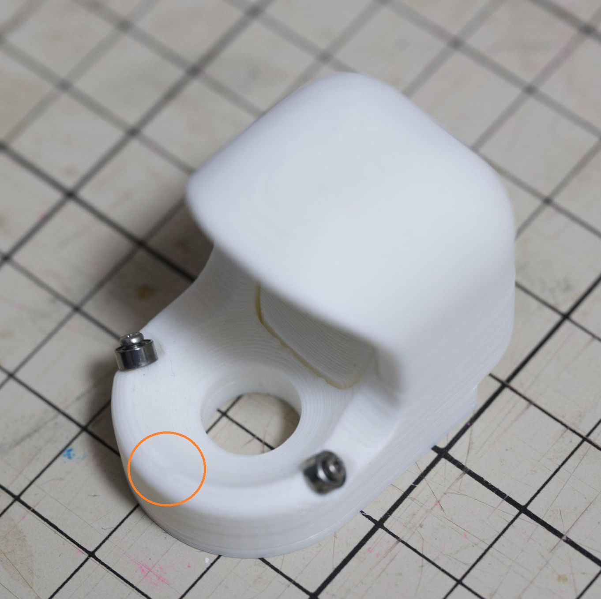  

### トラックボールケース取り付け

トラックボールケースをキーボードケース本体に取り付けます。  
まずセンサー PCB をメイン PCB に取り付けます。  
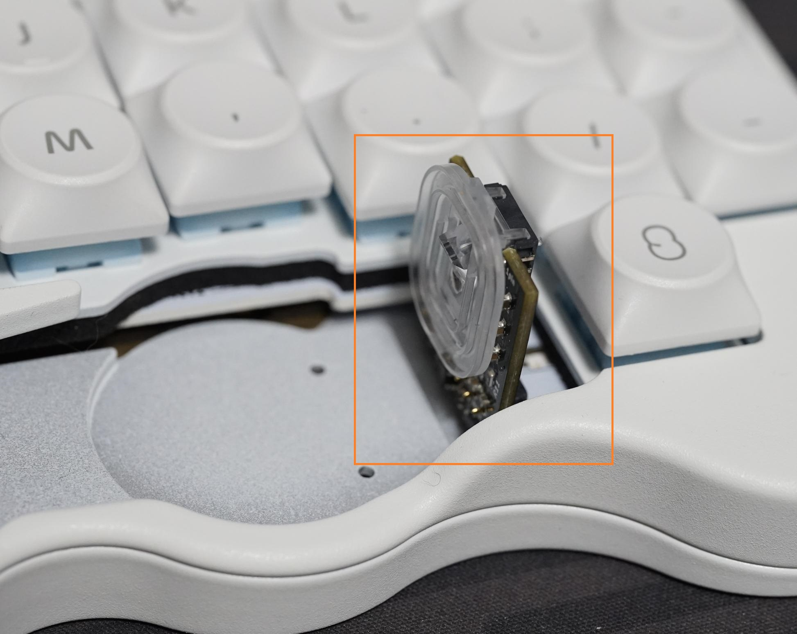

センサー PCB が外れないように、トラックボールケースを上からゆっくりかぶせます。  
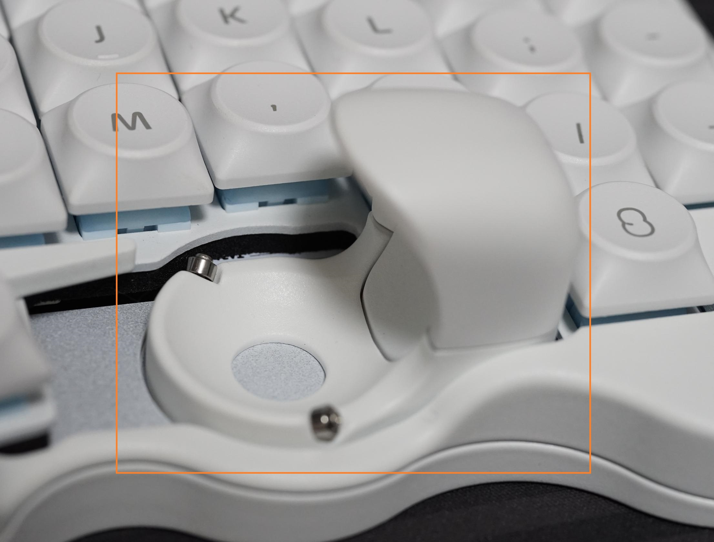

トラックボールケースが落ちないように押さえながら、キーボードの裏側から M1.7 ネジで固定します。  
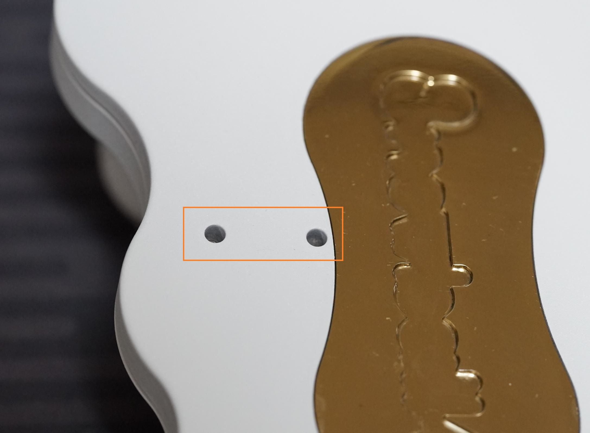

トラックボールケースを指でゆすっても動かないことを確認出来たら組み立て完了です。

25mmトラックボールケースを取り付けたとき、隙間が気になるようであれば三日月形プレートを両面テープで貼り付けます。  
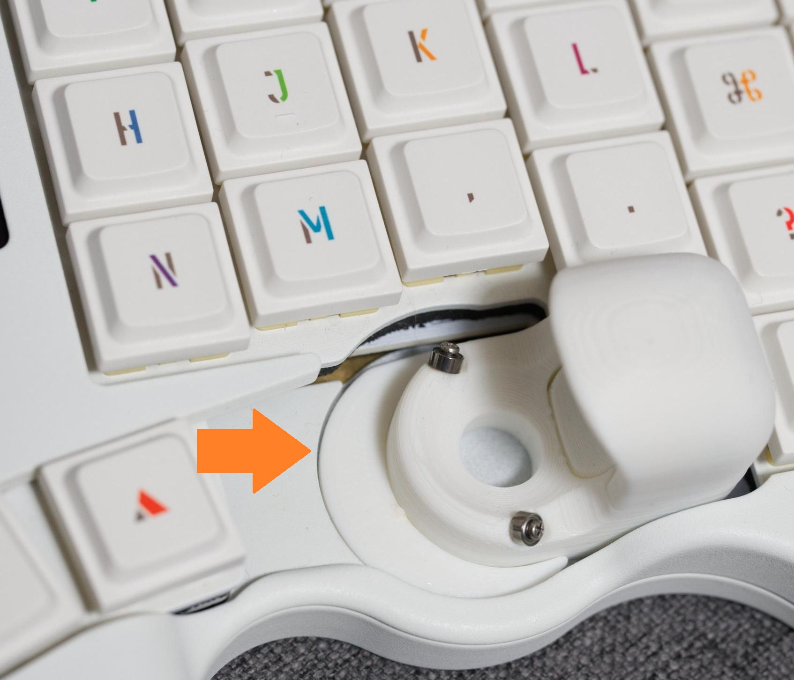  


以上です, それでは快適な Snowball44 生活をお送りください!!
ハッシュタグは #Snowball44 です. x にハッシュタグつきでポストしていただけると励みになります!!
